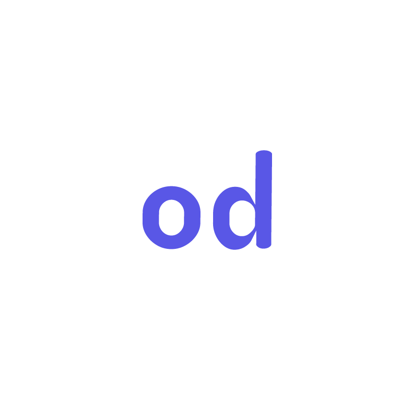

# Responsive Navigation Bar 🔰🔰🔰


[navigation-bar](https://youtu.be/bQR_iOy92Qw)

[navigation-bar-source-code](https://github.com/emetdas/youtube_Navigation_project)


# Sticky Navigation Bar Code Snipets 🔰🔰🔰

## HTML
```Html5
<!DOCTYPE html>
<html lang="en">
  <head>
    <meta charset="UTF-8" />
    <meta http-equiv="X-UA-Compatible" content="IE=edge" />
    <meta name="viewport" content="width=device-width, initial-scale=1.0" />
    <title>Navigation</title>
    <link rel="stylesheet" href="style.css" />
  </head>
  <body>
    <section id="hero">
      <header class="header">
        <div class="container">
          <nav class="navbar">
            <a href="#!" class="logo">
              
            </a>
            <div class="nav_icon">
              <div class="line"></div>
            </div>
            <ul class="nav_menu">
              <li class="nav_list">
                <a href="#!" class="nav_link">Home</a>
              </li>
              <li class="nav_list">
                <a href="#!" class="nav_link">About</a>
              </li>
              <li class="nav_list">
                <a href="#!" class="nav_link">Project</a>
              </li>
              <li class="nav_list">
                <a href="#!" class="nav_link">Contact</a>
              </li>
            </ul>
          </nav>
        </div>
      </header>
    </section>
    <section id="about">
      <h2>About</h2>
    </section>
    <script src="script.js"></script>
  </body>
</html>
```
## Css
```Css3
@import url('https://fonts.googleapis.com/css2?family=Poppins:wght@400;500;600;700&display=swap');
* {
  margin: 0;
  padding: 0;
  box-sizing: border-box;
}
html {
  font-size: 62.5%;
  font-family: 'Poppins', sans-serif;
}
:root {
  --nav: 6rem;
  --black: hsl(251, 67%, 5%);
  --white: hsl(0, 0%, 100%);
  --primary: hsl(249, 73%, 58%);
  --transition: all 1s cubic-bezier(0.175, 0.885, 0.32, 1.275);
}
.header {
  background: var(--primary);
}
.container {
  max-width: 114rem;
  margin: 0 auto;
  width: calc(100% - 2rem);
  padding: 0 2rem;
}
.navbar {
  height: var(--nav);
  display: flex;
  justify-content: space-between;
  align-items: center;
}
.logo img {
  width: 10rem;
  height: 5rem;
  object-fit: cover;
}
.nav_list {
  display: inline-block;
  margin: 0 1rem;
}
a {
  color: var(--white);
  font-size: 1.7rem;
  text-decoration: none;
}
.nav_icon {
  width: 3rem;
  height: 3rem;
  margin-top: 1.5rem;
  cursor: pointer;
  display: none;
}
.line {
  position: relative;
  transform: translateY(0.8rem);
  width: 100%;
  height: 0.3rem;
  background: var(--white);
}
.line:before,
.line:after {
  position: absolute;
  content: '';
  width: 100%;
  height: 0.3rem;
  background: var(--white);
  transition: var(--transition);
}
.line:before {
  transform: translateY(-0.7rem);
}
.line::after {
  transform: translateY(0.7rem);
}
.line.active {
  background: transparent;
}
.line.active:before {
  transform: rotate(45deg);
}
.line.active:after {
  transform: rotate(-45deg);
}
@media (max-width: 768px) {
  body {
    overflow-x: hidden;
  }
  .nav_icon {
    display: block;
  }
  .nav_menu {
    width: 100%;
    left: 0;
    position: absolute;
    height: calc(100vh - var(--nav));
    top: var(--nav);
    transition: var(--transition);
    background: var(--black);
    transform: translateX(100%);
  }
  .nav_menu.active {
    transform: translateX(0%);
    transition: transform 0.5s ease;
  }
  .nav_list {
    display: flex;
    flex-direction: column;
    text-align: center;
    margin: 3rem 0;
    transform: translateX(100%);
  }
}
@keyframes linkFadeIn {
  from {
    opacity: 0;
    transform: translateX(5rem);
  }
  to {
    opacity: 1;
    transform: translateX(0rem);
  }
}

/* sticky-navigation-css */
section {
  height: 100vh;
}
#about {
  background: rgb(192, 207, 255);
  display: flex;
  justify-content: center;
  align-items: center;
}
#about h2 {
  font-size: 4rem;
  color: var(--primary);
}
.sticky {
  position: fixed;
  width: 100%;
  animation: sticky 0.4s ease-in-out;
}
@keyframes sticky {
  to {
    transform: translateY(0);
    opacity: 1;
  }
  from {
    transform: translateY(-6rem);
    opacity: 0;
  }
}
```
## Javascript
```Javascript
let nav_icon = document.querySelector('.nav_icon');
let line = document.querySelector('.line');
let nav_menu = document.querySelector('.nav_menu');
let nav_links = document.querySelectorAll('.nav_list');
let nav_length = nav_links.length;
nav_icon.addEventListener('click', () => {
  line.classList.toggle('active');
  nav_menu.classList.toggle('active');
  nav_links.forEach((link, index) => {
    if (link.style.animation) {
      link.style.animation = '';
    } else {
      link.style.animation = `linkFadeIn 0.5s ease forwards ${
        index / nav_length + 0.2
      }s`;
    }
  });
});
let header = document.querySelector('.header');
let hero = document.querySelector('#hero');
let header_height = header.getBoundingClientRect().height;

let sticky = (entries) => {
  let [entry] = entries;
  if (!entry.isIntersecting) {
    console.log('sticky');
    header.classList.add('sticky');
  } else {
    header.classList.remove('sticky');
  }
};
let hero_observer = new IntersectionObserver(sticky, {
  root: null,
  threshold: 0,
  rootMargin: `-${header_height}px`,
});
hero_observer.observe(hero);
```